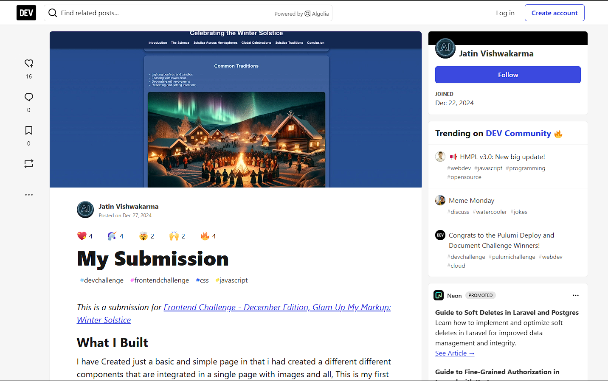
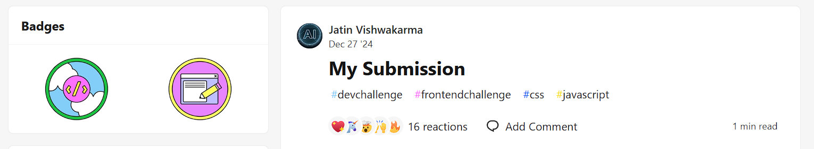

# ❄️ Glam Up My Markup: Winter Solstice | Dev Frontend Challenge - December Edition

This is my submission for the **Dev Frontend Challenge - December Edition**, titled **Glam Up My Markup: Winter Solstice**.

---

## 📰 Article Snapshots

Below are some glimpses from the article and designs of my submission:

  
   
  <em>Winter Solstice</em>

## 🏅 Badges

  

---

## 💡 What I Built

I created a **simple yet effective web page** with modular components and visuals reflecting the Winter Solstice theme. 

Although I faced a few technical hiccups 😅, it was a fun and insightful experience, and I managed to complete and submit my project.

---

## ✨ My Journey

- Researched the **Winter Solstice**, its meaning, culture, and how it is celebrated across the globe.
- Designed the components using **HTML**, **CSS**, and **JavaScript**.
- Kept things minimal and clean, focusing on responsiveness and structure.

---

## 🧠 Key Learnings

- Page structuring with real-world themes  
- Improving CSS skills for layout and responsiveness  
- How to manage creativity under a deadline 😅  

---

## 🧑‍💻 Submission Info

- 👨‍💻 Created by: [@jatin_vishwakarma](https://github.com/coddingjatin)  
- 🌐 GitHub Repo: [Dev-Frontend](https://github.com/coddingjatin/Dev-Frontend)  
- 📌 Challenge: Dev Frontend Challenge - Glam Up My Markup (Winter Edition)

---

## 💡 Feel Free to Use

This project is open-source and you're welcome to modify or extend it for your own or educational purposes.

---

## 🙌 Show Some Love

If you found this interesting or useful, don’t forget to ⭐ the repo!

---

## 📄 License

This project is licensed under the [MIT License](LICENSE).
